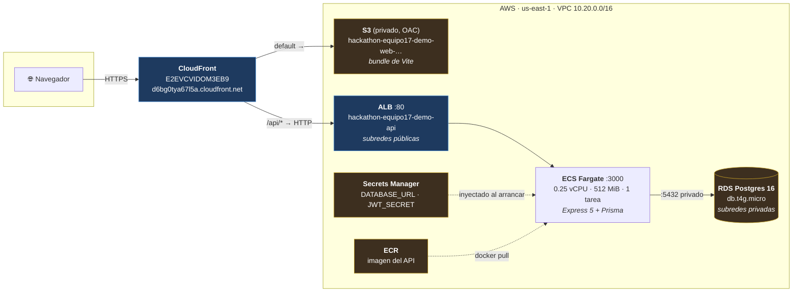
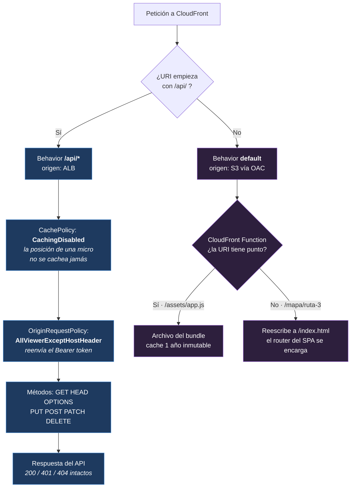
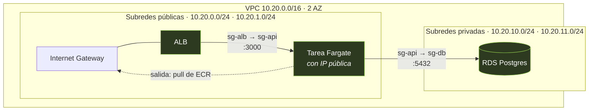
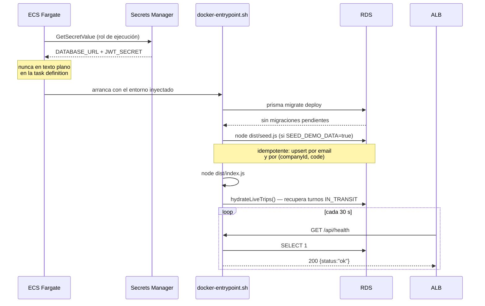
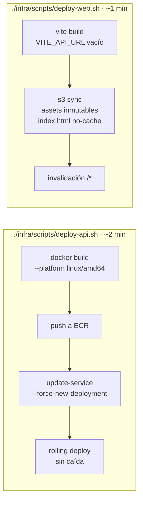

# Infraestructura desplegada — haCAIthon 2026, equipo 17

Stack **vivo** en AWS. Guía de operación y referencia visual; los detalles de cada recurso
están en [`infra/README.md`](infra/README.md) y el código en [`infra/terraform/`](infra/terraform/).

|         |                                                                                          |
| ------- | ---------------------------------------------------------------------------------------- |
| **Web** | https://d6bg0tya67l5a.cloudfront.net                                                     |
| **API** | https://d6bg0tya67l5a.cloudfront.net/api                                                 |
| Cuenta  | `admin_lebesgue` — 475345973285                                                          |
| Región  | `us-east-1`                                                                              |
| Prefijo | `hackathon-equipo17-demo`                                                                |
| Estado  | ALB target `healthy`, migraciones aplicadas, seed cargado (17 recorridos, 118 paraderos) |

> El frontend **no configura nada**: se sirve desde el mismo CloudFront que enruta `/api/*`,
> así que llama a rutas relativas (`fetch('/api/routes')`) igual que en desarrollo con el proxy
> de Vite. `VITE_API_URL` queda vacío en los dos entornos.

---

## Arquitectura



**Las dos decisiones que hacen que esto funcione:**

1. **`/api/*` pasa por CloudFront.** El navegador habla TLS con CloudFront y CloudFront habla
   HTTP con el ALB dentro de AWS. Sin esto haría falta un dominio y un certificado ACM, o el
   navegador bloquearía todos los `fetch` por _mixed content_ (página HTTPS → API HTTP).
   Efecto secundario: front y API quedan en el **mismo origen**, así que CORS desaparece.
2. **El fallback del SPA es una CloudFront Function, no `custom_error_response`.** Los errores
   personalizados son de **toda la distribución**: convertirían también los `403` de
   `requireRole` y los `404` de `notFound` en `index.html` con status `200`, y el frontend
   recibiría HTML donde espera JSON. La función solo está asociada al comportamiento del S3.

## Cómo se resuelve cada petición



## Red



Las tareas corren en subredes **públicas** con IP pública porque sin NAT Gateway es la única
forma de que bajen la imagen de ECR — pero su security group solo acepta tráfico del ALB, así
que no son alcanzables desde internet. Eso ahorra los ~USD 32/mes del NAT. Para cerrarlo del
todo: `enable_nat_gateway = true` en `terraform.tfvars`.

RDS nunca sale de las subredes privadas y solo acepta conexiones desde el security group de la
tarea. Para conectarse desde un portátil hay que pasar por un bastión o ECS Exec.

## Arranque del contenedor



El API **se niega a arrancar** en producción si `JWT_SECRET` sigue siendo el de desarrollo
(`apps/api/src/config/env.ts`). Por eso Terraform genera uno con `random_password` de 48
caracteres y lo guarda en Secrets Manager: nadie tiene que inventarlo ni pegarlo en ningún lado.

## Ciclo de despliegue



Los dos scripts leen todo de `terraform output`, así que no hay ninguna URL ni ARN escrito a
mano. Se pueden correr las veces que haga falta, en cualquier orden.

---

## Uso diario

```bash
# Publicar cambios del backend (cada vez que aterrice un controller)
./infra/scripts/deploy-api.sh

# Publicar cambios del frontend
./infra/scripts/deploy-web.sh

# Ver qué está pasando en la API
aws logs tail /ecs/hackathon-equipo17-demo-api --follow --region us-east-1
```

### Desarrollo local contra la API desplegada

En `apps/web/.env`, sin tocar nada más:

```bash
VITE_DEV_API_TARGET=https://d6bg0tya67l5a.cloudfront.net
```

`pnpm dev` y listo. El proxy de Vite es server-side, así que no hay CORS de por medio. Si en
cambio se llama directo con `fetch` desde el navegador, `CORS_ORIGIN` ya permite
`http://localhost:5173`.

### Credenciales de demo

Todas con clave **`demo1234`**:

| Email                                         | Rol                                     |
| --------------------------------------------- | --------------------------------------- |
| `superadmin@demo.cl`                          | SUPERADMIN                              |
| `admin@bupesa.cl`                             | COMPANY_ADMIN — Buses Peñaflor (Bupesa) |
| `chofer1@bupesa.cl` · `chofer2@` · `chofer3@` | DRIVER                                  |
| `pasajero@demo.cl`                            | PASSENGER                               |

```bash
curl -s -X POST https://d6bg0tya67l5a.cloudfront.net/api/auth/login \
  -H 'Content-Type: application/json' \
  -d '{"email":"admin@bupesa.cl","password":"demo1234"}'
```

### Micros moviéndose de verdad

El simulador habla HTTP igual que el teléfono de un chofer, así que funciona contra la infra
desplegada. Útil para desarrollar el mapa sin que nadie tenga que manejar:

```bash
API_URL=https://d6bg0tya67l5a.cloudfront.net pnpm --filter @equipo17/api simulate

# Para mostrar la degradación En vivo → Señal intermitente → Sin señal:
API_URL=https://d6bg0tya67l5a.cloudfront.net pnpm --filter @equipo17/api simulate -- --drop-signal
```

---

## Recursos creados

Todos con el prefijo `hackathon-equipo17-demo` y los tags `Hackathon=haCAIthon-2026`,
`Team=equipo-17`, `Temporary=true`, `DeleteAfter=2026-08-31`, `ManagedBy=terraform`.

| Recurso                                 | Nombre                                                 |
| --------------------------------------- | ------------------------------------------------------ |
| VPC / cluster ECS                       | `hackathon-equipo17-demo`                              |
| ALB / target group / servicio ECS / ECR | `hackathon-equipo17-demo-api`                          |
| RDS Postgres 16                         | `hackathon-equipo17-demo-db`                           |
| Bucket del frontend                     | `hackathon-equipo17-demo-web-475345973285`             |
| Distribución CloudFront                 | `E2EVCVIDOM3EB9`                                       |
| CloudFront Function                     | `hackathon-equipo17-demo-spa-rewrite`                  |
| Log group                               | `/ecs/hackathon-equipo17-demo-api` (retención 7 días)  |
| Secretos                                | `hackathon-equipo17-demo/database-url` · `/jwt-secret` |

**Costo:** ~USD 1,3/día — ALB ~16/mes, Fargate ~9, RDS ~15, S3+CloudFront ~1.

## Borrar todo al terminar

```bash
cd infra/terraform && terraform destroy
```

El bucket tiene `force_destroy`, ECR `force_delete`, RDS `skip_final_snapshot` y los secretos
`recovery_window_in_days = 0`, así que `destroy` no se queda a medias ni deja secretos en
cuarentena. Después, verificar que no quedó nada:

```bash
aws resourcegroupstaggingapi get-resources \
  --tag-filters Key=Hackathon,Values=haCAIthon-2026 \
  --region us-east-1 --query 'ResourceTagMappingList[].ResourceARN'
```

Debe devolver una lista vacía. El state de Terraform es **local** (`infra/terraform/`): si se
pierde ese archivo, el `destroy` hay que hacerlo a mano por consola.
